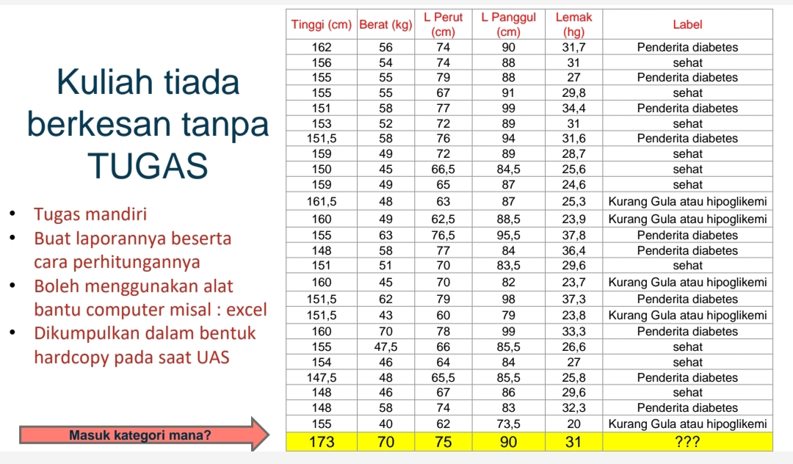

# knn-program-machine-learning
Exam:

Dengan Dataset yang telah di definisikan dalam program.

Output:

Query point ditemukan dengan atribut berikut:
Tinggi: 173
Berat: 70
Lingkar Perut: 75
Lingkar Panggul: 90
Lemak: 31

Perhitungan jarak Euclidean antara query point dan data point 1 (Penderita diabetes):
sqrt((173 - 162)^2 + (70 - 56)^2 + (75 - 74)^2 + (90 - 90)^2 + (31 - 31.7)^2)
sqrt(121 + 196 + 1 + 0 + 0.49)
= 17.846288129468

Perhitungan jarak Euclidean antara query point dan data point 2 (sehat):
sqrt((173 - 156)^2 + (70 - 54)^2 + (75 - 74)^2 + (90 - 88)^2 + (31 - 31)^2)
sqrt(289 + 256 + 1 + 4 + 0)
= 23.452078799117

Perhitungan jarak Euclidean antara query point dan data point 3 (Penderita diabetes):
sqrt((173 - 155)^2 + (70 - 55)^2 + (75 - 79)^2 + (90 - 88)^2 + (31 - 27)^2)
sqrt(324 + 225 + 16 + 4 + 16)
= 24.186773244896

Perhitungan jarak Euclidean antara query point dan data point 4 (sehat):
sqrt((173 - 155)^2 + (70 - 55)^2 + (75 - 67)^2 + (90 - 91)^2 + (31 - 29.8)^2)
sqrt(324 + 225 + 64 + 1 + 1.44)
= 24.808063205337

Perhitungan jarak Euclidean antara query point dan data point 5 (Penderita diabetes):
sqrt((173 - 151)^2 + (70 - 58)^2 + (75 - 77)^2 + (90 - 99)^2 + (31 - 34.4)^2)
sqrt(484 + 144 + 4 + 81 + 11.56)
= 26.91765220074

Perhitungan jarak Euclidean antara query point dan data point 6 (sehat):
sqrt((173 - 153)^2 + (70 - 52)^2 + (75 - 72)^2 + (90 - 89)^2 + (31 - 31)^2)
sqrt(400 + 324 + 9 + 1 + 0)
= 27.092434368288

Perhitungan jarak Euclidean antara query point dan data point 7 (Penderita diabetes):
sqrt((173 - 151.5)^2 + (70 - 58)^2 + (75 - 76)^2 + (90 - 94)^2 + (31 - 32)^2)
sqrt(462.25 + 144 + 1 + 16 + 1)
= 24.984995497298

Perhitungan jarak Euclidean antara query point dan data point 8 (sehat):
sqrt((173 - 159)^2 + (70 - 49)^2 + (75 - 72)^2 + (90 - 89)^2 + (31 - 28.7)^2)
sqrt(196 + 441 + 9 + 1 + 5.29)
= 25.539968676567

Perhitungan jarak Euclidean antara query point dan data point 9 (sehat):
sqrt((173 - 150)^2 + (70 - 45)^2 + (75 - 66.5)^2 + (90 - 84.5)^2 + (31 - 25.6)^2)
sqrt(529 + 625 + 72.25 + 30.25 + 29.16)
= 35.856101293922

Perhitungan jarak Euclidean antara query point dan data point 10 (sehat):
sqrt((173 - 159)^2 + (70 - 49)^2 + (75 - 65)^2 + (90 - 87)^2 + (31 - 24.6)^2)
sqrt(196 + 441 + 100 + 9 + 40.96)
= 28.052807346146

Perhitungan jarak Euclidean antara query point dan data point 11 (Kurang Gula atau hipoglikemi):
sqrt((173 - 161.5)^2 + (70 - 48)^2 + (75 - 69)^2 + (90 - 87)^2 + (31 - 25.3)^2)
sqrt(132.25 + 484 + 36 + 9 + 32.49)
= 26.338944549849

Perhitungan jarak Euclidean antara query point dan data point 12 (Kurang Gula atau hipoglikemi):
sqrt((173 - 160)^2 + (70 - 49)^2 + (75 - 62.5)^2 + (90 - 88.5)^2 + (31 - 23.9)^2)
sqrt(169 + 441 + 156.25 + 2.25 + 50.41)
= 28.616603572052

Perhitungan jarak Euclidean antara query point dan data point 13 (Penderita diabetes):
sqrt((173 - 155)^2 + (70 - 63)^2 + (75 - 76.5)^2 + (90 - 95.5)^2 + (31 - 38)^2)
sqrt(324 + 49 + 2.25 + 30.25 + 49)
= 21.319005605328

Perhitungan jarak Euclidean antara query point dan data point 14 (Penderita diabetes):
sqrt((173 - 148)^2 + (70 - 58)^2 + (75 - 77)^2 + (90 - 84)^2 + (31 - 36.4)^2)
sqrt(625 + 144 + 4 + 36 + 29.16)
= 28.950993074504

Perhitungan jarak Euclidean antara query point dan data point 15 (sehat):
sqrt((173 - 151)^2 + (70 - 51)^2 + (75 - 70)^2 + (90 - 83.5)^2 + (31 - 29.6)^2)
sqrt(484 + 361 + 25 + 42.25 + 1.96)
= 30.2359058075

Perhitungan jarak Euclidean antara query point dan data point 16 (Kurang Gula atau hipoglikemi):
sqrt((173 - 160)^2 + (70 - 45)^2 + (75 - 70)^2 + (90 - 82)^2 + (31 - 23.7)^2)
sqrt(169 + 625 + 25 + 64 + 53.29)
= 30.598856187773

Perhitungan jarak Euclidean antara query point dan data point 17 (Penderita diabetes):
sqrt((173 - 151.5)^2 + (70 - 62)^2 + (75 - 79)^2 + (90 - 98)^2 + (31 - 37.3)^2)
sqrt(462.25 + 64 + 16 + 64 + 39.69)
= 25.415349692656

Perhitungan jarak Euclidean antara query point dan data point 18 (Kurang Gula atau hipoglikemi):
sqrt((173 - 151.5)^2 + (70 - 43)^2 + (75 - 60)^2 + (90 - 79)^2 + (31 - 23.8)^2)
sqrt(462.25 + 729 + 225 + 121 + 51.84)
= 39.863391727248

Perhitungan jarak Euclidean antara query point dan data point 19 (Penderita diabetes):
sqrt((173 - 160)^2 + (70 - 70)^2 + (75 - 78)^2 + (90 - 99)^2 + (31 - 33.3)^2)
sqrt(169 + 0 + 9 + 81 + 5.29)
= 16.256998492957

Perhitungan jarak Euclidean antara query point dan data point 20 (sehat):
sqrt((173 - 155)^2 + (70 - 47.5)^2 + (75 - 66)^2 + (90 - 85.5)^2 + (31 - 26.6)^2)
sqrt(324 + 506.25 + 81 + 20.25 + 19.36)
= 30.836017901149

Perhitungan jarak Euclidean antara query point dan data point 21 (sehat):
sqrt((173 - 154)^2 + (70 - 46)^2 + (75 - 64)^2 + (90 - 84)^2 + (31 - 27)^2)
sqrt(361 + 576 + 121 + 36 + 16)
= 33.316662497915

Perhitungan jarak Euclidean antara query point dan data point 22 (Penderita diabetes):
sqrt((173 - 147.5)^2 + (70 - 48)^2 + (75 - 65.5)^2 + (90 - 85.5)^2 + (31 - 25.8)^2)
sqrt(650.25 + 484 + 90.25 + 20.25 + 27.04)
= 35.662164824923

Perhitungan jarak Euclidean antara query point dan data point 23 (sehat):
sqrt((173 - 148)^2 + (70 - 46)^2 + (75 - 67)^2 + (90 - 86)^2 + (31 - 29.6)^2)
sqrt(625 + 576 + 64 + 16 + 1.96)
= 35.818431009747

Perhitungan jarak Euclidean antara query point dan data point 24 (Penderita diabetes):
sqrt((173 - 148)^2 + (70 - 58)^2 + (75 - 74)^2 + (90 - 83)^2 + (31 - 32.3)^2)
sqrt(625 + 144 + 1 + 49 + 1.69)
= 28.647687515749

Perhitungan jarak Euclidean antara query point dan data point 25 (Kurang Gula atau hipoglikemi):
sqrt((173 - 155)^2 + (70 - 40)^2 + (75 - 62)^2 + (90 - 73.5)^2 + (31 - 20)^2)
sqrt(324 + 900 + 169 + 272.25 + 121)
= 42.264050918008

Jarak terdekat (k = 5):
Data point 19 (Penderita diabetes): 16.256998492957
Data point 1 (Penderita diabetes): 17.846288129468
Data point 13 (Penderita diabetes): 21.319005605328
Data point 2 (sehat): 23.452078799117
Data point 3 (Penderita diabetes): 24.186773244896

Label yang diprediksi untuk query point: Penderita diabetes
Votes ↓
Penderita diabetes: 4
sehat: 1
